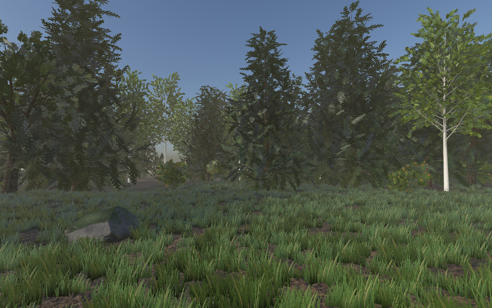
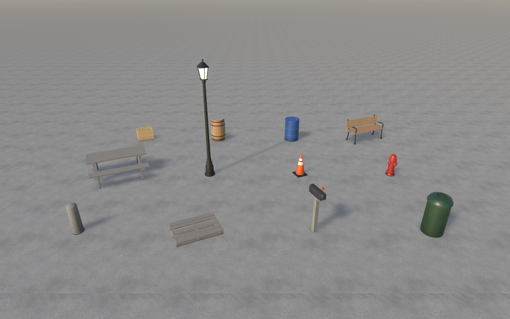

# RealForge

[](https://swift.org)
[](#requirements)
[](#installation)
[](LICENSE)

Procedural, photoreal trees, rocks, ground, props and scenes for RealityKit, generated from code at
load time. No mesh or texture files ship in your app: geometry is built on the CPU in milliseconds and
every PBR texture is synthesized on the GPU.



## Contents

- [Features](#features)
- [Requirements](#requirements)
- [Installation](#installation)
- [Quick start](#quick-start)
- [Usage](#usage)
- [Gallery](#gallery)
- [Performance](#performance)
- [Command-line tool](#command-line-tool)
- [Package structure](#package-structure)
- [Contributing](#contributing)
- [License](#license)

## Features

- 21 assets and 3 composed scenes: oak, birch, spruce, shrub, boulder, pebbles, terrain, grass, and
  12 street and park props. Every asset is parameterized and seeded.
- Trees with recursive branching, root flare, alpha-card foliage, crown-sphere normals, baked crown
  occlusion and three LODs built from one skeleton.
- 29 GPU-synthesized PBR materials (albedo, normal, roughness, AO, metallic), all tileable, with
  coverage-preserving alpha mips for foliage.
- ShaderGraph materials generated at runtime: vertex wind, leaf back-light translucency, aerial
  perspective fog, ground anti-tiling, triplanar rock projection, moss on upward faces.
- Physically based sky (Rayleigh, Mie, ozone) used for image-based lighting and the skybox, with a
  matching shadow-casting sun.
- `MeshInstancesComponent` instancing in spatial cells, distance LOD with hysteresis, head-tracked LOD
  on visionOS, quality presets.
- Offscreen PNG rendering through `RealityRenderer` for previews, thumbnails and automated checks.

## Requirements

| Platform | Minimum |
|---|---|
| visionOS | 26.0 |
| macOS | 26.0 |
| iOS | 26.0 |
| Xcode | 26.0 (Swift 6.2 tools) |

Metal is required for texture synthesis. ARKit world tracking (visionOS, ImmersiveSpace) is used only
for head-tracked LOD.

## Installation

### Xcode

File > Add Package Dependencies, enter the repository URL, and add the `RealForge` product to your
app target.

```
https://github.com/hunterh37/RealForge.git
```

### Package.swift

```swift
dependencies: [
    .package(url: "https://github.com/hunterh37/RealForge.git", branch: "main"),
],
targets: [
    .target(name: "MyApp", dependencies: [.product(name: "RealForge", package: "RealForge")]),
]
```

## Quick start

A full forest in an immersive space:

```swift
import SwiftUI
import RealityKit
import RealKit
import RealLibrary

@main
struct ForestApp: App {
    init() { RealForge.setup(.balanced) }

    var body: some Scene {
        ImmersiveSpace(id: "forest") {
            RealityView { content in
                let env = try! RealForge.environment(.afternoon, skybox: true)
                let forest = try! await RealForge.scene("forest-glade")
                env.illuminate(forest)
                content.add(env.root)
                content.add(forest)
            }
            .task { await RealViewerTracker.shared.start() }
        }
        .immersionStyle(selection: .constant(.full), in: .full)
    }
}
```

## Usage

### Single assets

```swift
let oak = try await RealForge.entity("oak-tree", seed: 4)
let hydrant = try await RealForge.entity("fire-hydrant")
content.add(oak)
```

### Custom parameters

Assets are value types with stored parameters; edit them inline.

```swift
let drum  = try await RealForge.entity(OilDrum().with { $0.color = 0x8C1F1F })
let birch = try await RealForge.entity(Tree(.birch).with { $0.species.height = 9 }, seed: 2)
let rock  = try await RealForge.entity(Boulder().with { $0.size = [3, 1.6, 2.4]; $0.facets = 12 })
```

### Instanced fields

One draw per cell per LOD, however many instances.

```swift
let spots = Scatter.poisson(count: 400, outerRadius: 60, minSpacing: 4, seed: 1)
let transforms = spots.map { place($0.x, $0.y, yaw: .random(in: 0...360)).matrix }
let forest = try await RealForge.field(SpruceTree(), transforms: transforms)
```

### Lighting

```swift
let env = try RealForge.environment(SunSky(elevation: 20, azimuth: 250, turbidity: 2.8), skybox: true)
env.illuminate(myContent)   // image-based light for every model under it
content.add(env.root)       // sun with cascaded shadows, IBL entity, optional skybox
```

Presets: `.morning`, `.midday`, `.afternoon`, `.goldenHour`. In mixed reality pass `skybox: false`, or
skip the environment and let system lighting apply (set `RealAtmosphere.fogDensity = 0` indoors).

### Wind, fog and quality

```swift
RealWind.direction = [1, 0, 0.3]; RealWind.strength = 1.5      // before materials are created
RealAtmosphere.fogDensity = 0.002
RealForge.setup(.performance)                                  // 512 px textures
```

### Materials on your own meshes

```swift
var m = Model(name: "plinth")
m.add(Prim.roundedBox([1, 0.4, 1], radius: 0.03, material: "concrete.smooth"))
let entity = try await m.modelEntityAsync()
```

Material keys accept a hex tint: `"metal.painted:1F4E8C"`. All keys are listed in
[CATALOG.md](CATALOG.md).

## Gallery

### Scenes

| `forest-glade` | `park-path` |
|---|---|
|  |  |
| `park-path`, golden hour | `prop-yard` |
|  |  |

### Nature


### Props


| | | | |
|---|---|---|---|
| <br>`wooden-crate` | <br>`barrel` | <br>`oil-drum` | <br>`park-bench` |
| <br>`picnic-table` | <br>`street-lamp` | <br>`traffic-cone` | <br>`fire-hydrant` |
| <br>`bollard` | <br>`pallet` | <br>`mailbox` | <br>`trash-can` |

### Materials

Albedo channel of the GPU-generated texture sets.


## Performance

Release build on an M2 Pro (`swift run -c release realforge bench`).

| Measure | Result |
|---|---|
| Oak / birch / spruce generation, 3 LODs | 12 / 17 / 13 ms |
| Prop generation | 0.2 to 2 ms |
| 1024² PBR texture set on the GPU | 7 to 20 ms |
| `forest-glade` build + upload | 0.3 s + 0.9 s, 7,555 instances in 422 instanced draws |
| `park-path` build + upload | 0.08 s + 0.16 s, 22,120 instances |
| Tree LOD0 / LOD1 / LOD2 | ~20k / ~8k / ~2.5k triangles |
| Texture memory, `.balanced` | ~11 MB per material |

Instancing by spatial cell, LOD every 0.2 s with hysteresis, no shadow casting for grass and LOD2,
foliage twigs implied by cards, shared per-key textures, RG8 normal maps and quality presets keep
scenes at frame rate on Vision Pro.

## Command-line tool

```sh
swift run -q realforge list                      # assets and scenes
swift run -q realforge stats oak-tree            # triangles per LOD, materials, generation time
swift run -q realforge render park-bench         # out/park-bench.png via RealityRenderer
swift run -q realforge render forest-glade --sky golden --w 1920 --h 1080
swift run -q realforge textures bark.oak         # dump albedo/normal/roughness PNGs
swift run -q realforge shaders                   # load every ShaderGraph variant
swift run -q realforge catalog                   # regenerate CATALOG.md
swift run -c release realforge bench
```

## Package structure

| Target | Contents |
|---|---|
| `RealCore` | Surfaces, models, LODs, primitives, tree generator, noise, scatter. No RealityKit. |
| `RealMaterials` | Material library and Metal texture synthesis, sky rendering. |
| `RealKit` | LowLevelMesh upload, material cache, ShaderGraph emitter, environment, LOD, instancing, preview. |
| `RealLibrary` | Asset catalog, props, scenes, `RealForge` entry points. |
| `realforge` | Command-line tool. |

Design notes are in [DESIGN.md](DESIGN.md). The agent workflow and API cheat sheet are in
[CLAUDE.md](CLAUDE.md).

## Contributing

1. Add an asset as a `RealAsset` in `Sources/RealLibrary` and register it in `Catalog`.
2. `swift test` (determinism, triangle budgets, grounding, winding, material keys).
3. `swift run -q realforge render <id>` and check the PNG.
4. `swift run -q realforge catalog`, then open a pull request.

## License

RealForge is available under the MIT license. See [LICENSE](LICENSE).
